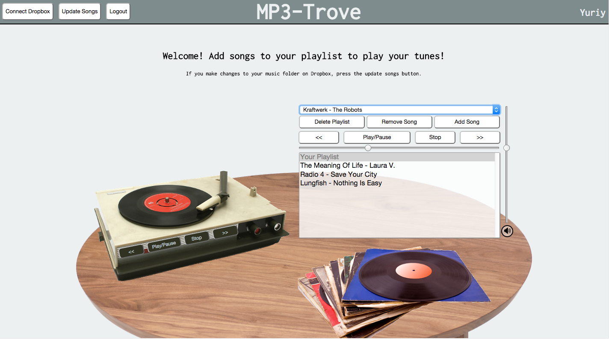

# MP3 Trove
## By [Yuriy Turetskiy](https://github.com/yuriyt2)

### Purpose
+ An app that allows users to play MP3 files directly from their Dropbox account.  A user is able to upload a collection of MP3s and play them remotely wherever they go.  

### Features
+ Users are required to create an account in order to access the application.
+ The app allows a logged in user to connect to their Dropbox account.
+ A user logged in and connect to their dropbox may update their song list with their current MP3 collection in Dropbox.
+ A user whose song collection is updated can create a playlist of their MP3s and play songs.
+ Users can play/pause/stop songs, rewind to beginning of a song and go backwards/forwards between songs in a playlist.
+ Users are provided with volume and seek sliders.  The seek bar moves proportionally as the song plays.
+ A second set of functioning play/pause/stop/back/forward buttons are available on the turntable image.

### Technology Used
+ Node.js
+ MongoDB
+ Express
+ jQuery
+ Sound Manager 2
+ Dropbox API
+ JavaScript ID3 Reader

### Technical Details
+ To avoid frequent database access the app only accesses its MongoDB once, upon login, to acquire the user's song list.
+ Once a user is connected to Dropbox, the API is accessed to generate temporary links for songs added to the playlist.  Sound Manager 2 plays the song from the temporary link, thus avoiding the need for the user to download the MP3s locally and the API is only accessed when necessary.
+ A user may only play songs from a Dropbox account they have access to.
+ The app can only accesses files in the file folder it creates in a user's Dropbox account and is unable to access any of the other files a user may have in their account.

### Setup
To test the app out locally:

1. Clone the repository.
2. Run a Node.js server from the app folder.
3. Run a MongoDB server.
4. Create a user account and log in.
5. Click the "Connect Dropbox" button and provide your user information to Dropbox.
6. Upload any songs you may wish to play to the remote_music_app folder Dropbox creates inside the Apps folder of your Dropbox account.
7. Log back into MP3 Trove and click the "Update Songs" button.  This can take a few minutes for large song collections.
8. Once the songs have been updated your song list will be populated and you can use the app's features.
9. Your song list will remain saved in the app's database and be available on return visits.
